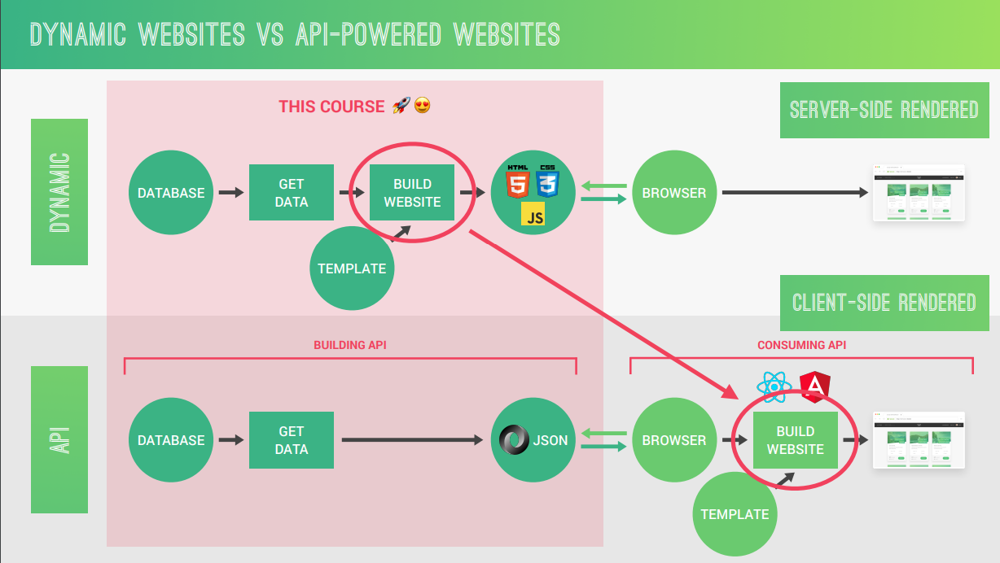

# Static vs Dynamic vs API Websites

**Static Websites:**

- **Content:** Pre-written HTML files that are delivered "as is" to the user's browser.
- **Updates:** Updating content requires manually editing the HTML files and uploading them to the server.
- **Examples:** Personal portfolios, simple landing pages, brochure websites.

**Pros:**

- **Fast loading times:** No server-side processing needed, making them lightning-fast to load.
- **Simple setup:** Easier to set up and maintain compared to dynamic websites.
- **Security:** Less vulnerable to attacks since there's no complex server-side code to exploit.
- **Cost-effective:** Lower hosting costs due to minimal server resources required.

**Cons:**

- **Limited interactivity:** Can't offer features like user logins, dynamic content updates, or shopping carts.
- **Content updates:** Updating content requires manual intervention, which can be cumbersome for frequently changing information.
- **Scalability:** Not ideal for large-scale websites with constantly changing content.

**Dynamic Websites:**

- **Content:** Generated "on the fly" by server-side scripting languages (like PHP, Python, Node.js) that access databases to deliver personalized or up-to-date content.
- **Updates:** Updating content is easier as changes are made in the database, reflected across all pages that use that data.
- **Examples:** E-commerce websites, social media platforms, news websites with frequently updated content.

**Pros:**

- **Rich interactivity:** Can offer a wide range of features including user logins, dynamic content updates, shopping carts, and more.
- **Content management systems (CMS):** Easier to update content through user-friendly interfaces without manually editing code.
- **Scalability:** Can handle large amounts of dynamic content and complex user interactions.

**Cons:**

- **Slower loading times:** Server-side processing adds a layer of complexity that can impact loading speeds.
- **Security:** Increased complexity introduces more potential security vulnerabilities.
- **Development costs:** Can be more expensive to develop and maintain due to the server-side scripting and databases involved.

**API Websites (Application Programming Interface):**

- **Concept:** Not technically a complete website, but an interface that allows other applications to access specific data or functionality.
- **Functionality:** APIs provide structured data (like JSON) that other applications can use to display information or interact with the API's services.
- **Examples:** Weather apps that use weather APIs, social media apps that use APIs to connect to social networks, online payment systems that use APIs.

**Pros:**

- **Data sharing:** Enables applications to share data and functionality with each other, creating a more interconnected ecosystem.
- **Modular development:** APIs promote modular development, where different parts of an application can be built and maintained independently.
- **Customization:** Applications can integrate APIs to offer unique features and functionalities.

**Cons:**

- **Complexity:** Requires knowledge of API protocols and formats to use them effectively.
- **Reliance on external services:** Applications depend on the availability and reliability of external APIs.

**Choosing the Right Option:**

The best choice for your website depends on your specific needs:

- **Static websites:** Ideal for simple websites with minimal interactivity and infrequent content updates.
- **Dynamic websites:** Go for dynamic websites if you need a highly interactive website with user accounts, frequently changing content, and complex functionalities.
- **API websites:** Use APIs if you want to share data or functionality with other applications or build a custom application with specific features from existing APIs.

In some cases, you might even combine these approaches. For example, a website might use a static HTML framework for its core structure and integrate a dynamic API backend to handle user logins and data updates.

## Static vs Dynamic

## Dynamic vs API

## API

