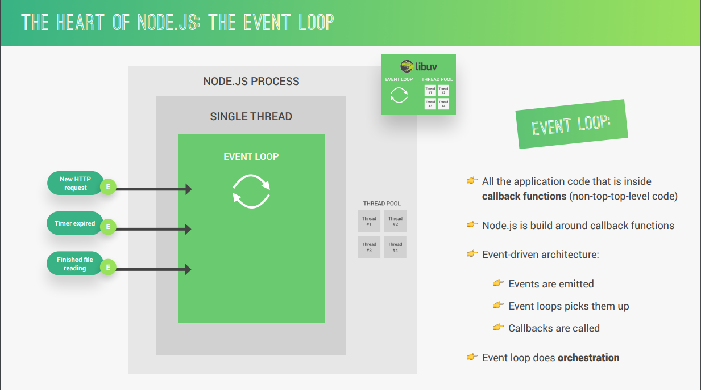
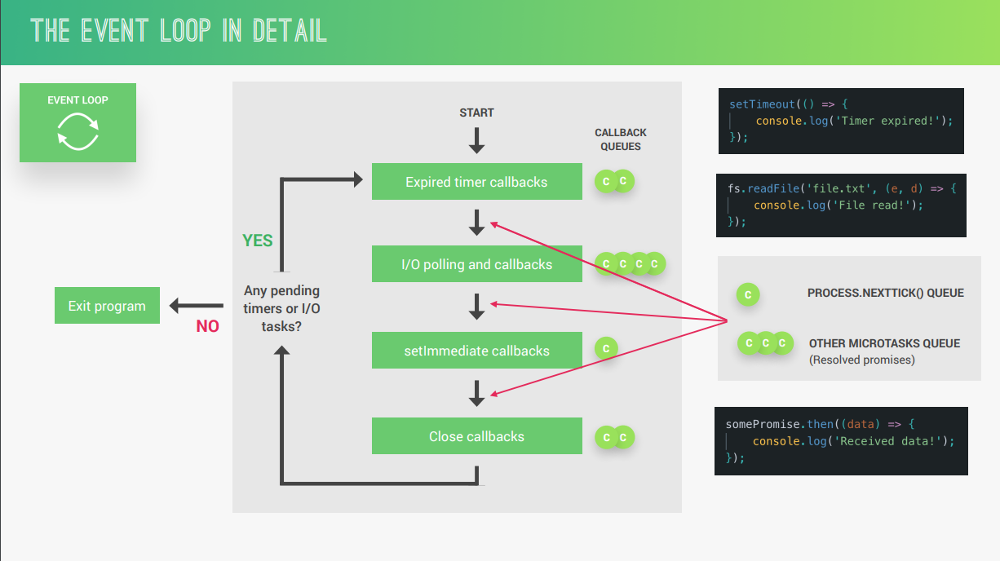
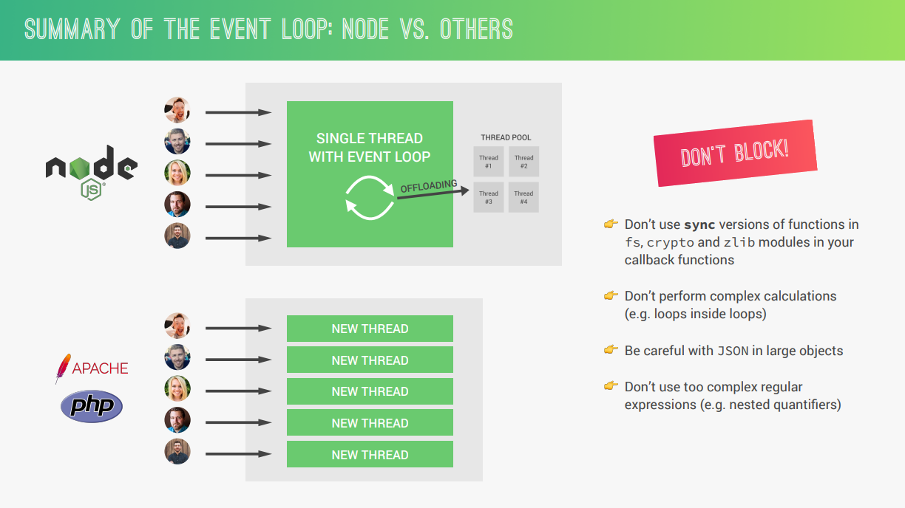

# Event Loop

The Node.js event loop is a fundamental concept that underpins its asynchronous, non-blocking nature. It's essentially an infinite loop that continuously monitors for events, executes callbacks associated with those events, and ensures efficient resource utilization. Here's a breakdown of its key aspects:

**Core Functionality:**

- The event loop constantly runs for as long as the Node.js application is executing.
- It maintains a queue (or multiple queues) of callback functions waiting to be executed.
- The event loop works in phases, handling different types of events in a specific order.

**Event Queues:** Node.js typically has multiple event queues for various event types, such as:
  - Timers (e.g., `setTimeout`, `setInterval`)
  - I/O callbacks (e.g., file system operations, network requests)
  - Check queues (for `setImmediate` function)
  - Close callbacks (for closing handles)

**Event Loop Phases:** Each phase in the event loop focuses on a particular type of event:
  1. **Poll:** Waits for I/O events from the operating system using libuv.
  2. **Check:** Executes callbacks from the check queue (high-priority).
  3. **Timers:** Executes callbacks from the timers queue based on timers expiring.
  4. **Pending callbacks:** Executes any remaining pending callbacks from previous phases (less common).
  5. **Close callbacks:** Executes callbacks associated with closing handles (like closing a network connection).

**Event Loop Execution:**

1. **Empty Call Stack:** The event loop only processes events when the call stack is empty (no JavaScript code is currently executing).
2. **Phase Execution:** The event loop enters a phase and processes all the callbacks in the corresponding queue until the queue is empty or a certain limit is reached.
3. **Next Phase:** If a queue is exhausted or the limit is reached, the event loop moves on to the next phase and repeats the process.
4. **Monitoring:** Throughout the phases, the event loop continues to monitor for new events from the operating system or timers expiring.
5. **Event Addition:** When a new event occurs (e.g., I/O completes), the corresponding callback function is added to the appropriate event queue.

**Benefits of the Event Loop:**

- **Non-Blocking I/O:** By handling I/O operations asynchronously, Node.js can avoid blocking the main thread, allowing it to continue executing JavaScript code while waiting for I/O to complete.
- **Efficient Resource Management:** The event loop ensures that the CPU isn't idle while waiting for I/O. It efficiently switches between tasks, making the most of available resources.
- **Scalability:** The event loop's ability to handle multiple concurrent connections effectively makes Node.js suitable for building scalable applications.
---

### In Detail:

### Node vs Others:

