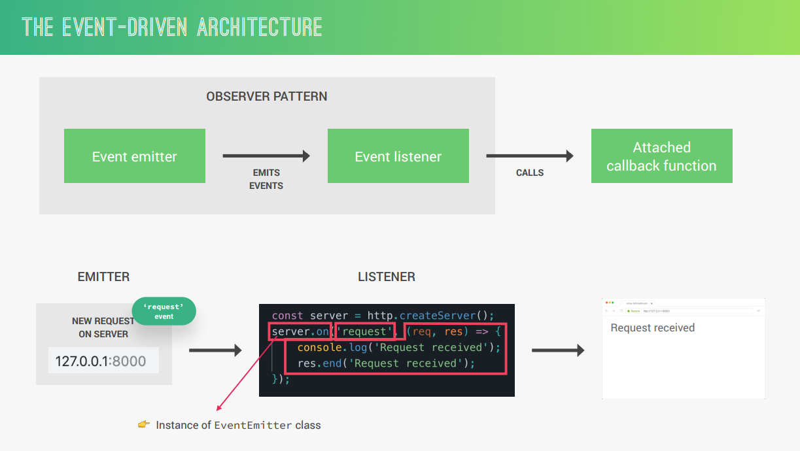

# EVENTS AND EVENT-DRIVEN ARCHITECTURE

In Node.js, events and event-driven architecture (EDA) are fundamental concepts that power its asynchronous, non-blocking nature. Here's a breakdown of both:

**Events:**

* **Concept:** Events are signals that indicate something has happened within your application. They can be triggered by various sources like:
    * User actions (clicks, form submissions)
    * System events (file system changes, network requests)
    * Internal application logic (timers expiring, calculations completing)
* **Components:** Events involve two main components:
    * **Event emitters:** Objects that can emit (trigger) events when something happens. Many built-in Node.js modules and custom objects can be event emitters.
    * **Event listeners:** Functions that are registered to be called when a specific event is emitted. Event listeners essentially define how the application reacts to an event.

**Example:**

```javascript
const EventEmitter = require('events'); // Import the EventEmitter class

// Create a custom event emitter
const myEmitter = new EventEmitter();

// Define an event listener
function handleButtonClick() {
  console.log('Button clicked!');
}

// Register the event listener for the 'click' event
myEmitter.on('click', handleButtonClick);

// Emit the 'click' event (simulating a button click)
myEmitter.emit('click');
```

In this example:

- `myEmitter` is the event emitter.
- `handleButtonClick` is the event listener function.
- We register the listener for the `'click'` event using `myEmitter.on()`.
- Finally, we emit the `'click'` event using `myEmitter.emit()`, which triggers the registered listener (`handleButtonClick`).

**Event-Driven Architecture (EDA) in Node.js:**

* **Core Principle:** EDA is an architectural style where applications are designed around handling events. Node.js is built to thrive in this paradigm due to its event loop and asynchronous capabilities.
* **Benefits:**
    * **Scalability:** Loose coupling through events allows for easier scaling of applications as components can be added or removed without affecting others.
    * **Responsiveness:** Asynchronous handling of events ensures the application remains responsive to incoming requests even if other tasks are ongoing.
    * **Maintainability:** Event-driven code can be more modular and easier to understand by focusing on how components react to events.

**Event Loop:**

* **Function:** The event loop is the heart of Node.js's event handling. It's a single-threaded loop that continuously:
    * Monitors for events from various sources.
    * Queues event listener functions associated with those events.
    * Processes these listener functions when the call stack is empty (no JavaScript code is currently executing).
* **Importance:** The event loop ensures efficient handling of asynchronous operations and concurrent requests without blocking the main thread.

**In essence, events and EDA provide a powerful mechanism for building asynchronous, responsive, and modular applications in Node.js.** By leveraging events and the event loop, you can create applications that can handle multiple requests simultaneously, scale effectively, and make the most of Node.js's strengths.

