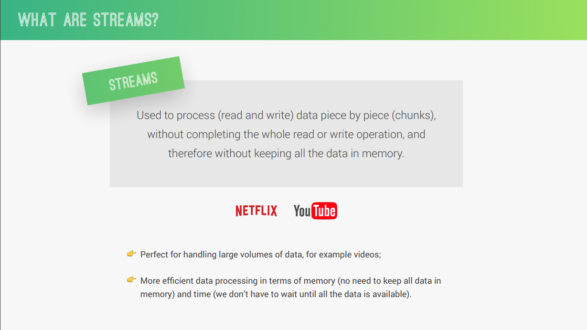
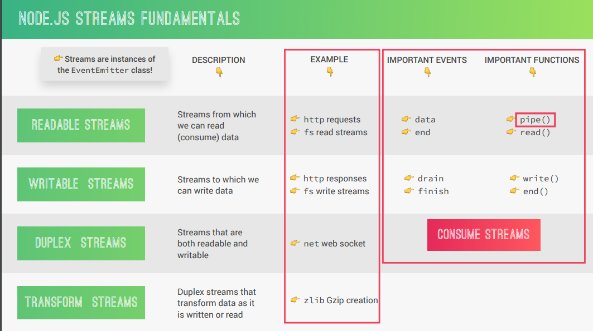

# Streams in Node.Js

Streams are a fundamental concept in Node.js for handling large amounts of data efficiently. They provide an abstraction for dealing with data that is generated or consumed in chunks over time, rather than all at once. This is particularly useful for scenarios like:

- Reading large files
- Processing data from network requests (uploading or downloading)
- Working with real-time data sources (e.g., sensor readings)

**Types of Streams:**

Node.js provides three main types of streams:

1. **Readable Streams:** Represent a source of data that can be read from. Examples include file system read streams, network request streams (incoming data).
2. **Writable Streams:** Represent a destination where data can be written to. Examples include file system write streams, network request streams (outgoing data).
3. **Duplex Streams:** Can both read and write data. Less common, but useful for scenarios like interacting with network sockets.

**The Stream Interface:**

Streams adhere to an abstract interface that defines methods for handling data flow and events. While the exact methods might differ slightly for different types of streams, here are some common ones:

- `on('data', callback)`: Invoked whenever a chunk of data is available to be read from a readable stream.
- `on('end', callback)`: Invoked when the end of the data has been reached in a readable stream.
- `write(data, callback)`: Writes data to a writable stream. Returns `false` if the stream's buffer is full.
- `on('drain', callback)`: Invoked for writable streams when the buffer becomes free for more data to be written.

**Using Streams:**

Node.js offers built-in modules and functions for working with streams:

- `fs.createReadStream()`: Creates a readable stream for reading files.
- `http.request()`: Creates a writable stream for sending data to a server and a readable stream for receiving data from the server.
- `process.stdout`: A writable stream representing the standard output console.

**Benefits of Streams:**

- **Efficient Memory Usage:** By dealing with data in chunks, streams avoid loading the entire dataset into memory at once. This is especially beneficial for large files or real-time data streams.
- **Backpressure Handling:** Streams can handle backpressure situations where the receiving end (e.g., network connection) is slow. The readable stream can pause the data flow until the writable stream is ready to accept more data.
- **Piping:** Streams can be easily chained together using the pipe operator (`|`) to create data pipelines for processing data in a modular fashion.

**Example:**

```javascript
const fs = require('fs');

// Create a readable stream for a file
const readStream = fs.createReadStream('large_file.txt');

// Handle data events
readStream.on('data', (chunk) => {
  console.log('Received chunk of data:', chunk.toString());
});

// Handle end event
readStream.on('end', () => {
  console.log('Finished reading the file');
});
```
---


